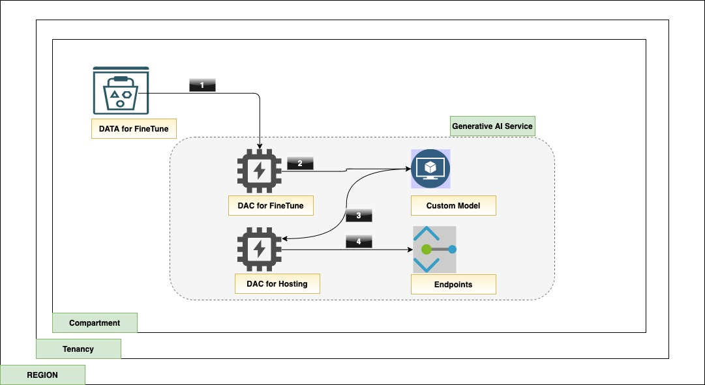

## OCI Terraform Genai Service Infra
Oracle Cloud Infrastructure Generative AI is a fully managed service that provides a set of state-of-the-art, customizable large language models (LLMs) that cover a wide range of use cases
This terraform stack helps to accelerate the GenAI service bootstrap with various resources including a sample data.

### Pictorial view 



### Resource details.

1. An object storage bucket with a sample `jsonl` data which will be used for creating a custom model.
1. A Generative AI Dedicated Cluster (DAC) for tune the model with the sample data from object storage.
1. A fine-tuned custom model.
1. A Generative AI Dedicated Cluster (DAC) for hosting the custom model and endpoints to access the custom model.

[](images/use.mp4)

## Deploy Using Oracle Resource Manager

1. Click [](https://cloud.oracle.com/resourcemanager/stacks/create?region=home&zipUrl=https://github.com/oracle-devrel/terraform-oci-arch-devops-cicd-instances/releases/latest/download/terraform-oci-arch-devops-cicd-instances-stack-latest.zip)

   If you aren't already signed in, when prompted, enter the tenancy and user credentials.

2. Review and accept the terms and conditions.

3. Select the region where you want to deploy the stack.

4. Follow the on-screen prompts and instructions to create the stack.

5. After creating the stack, click **Terraform Actions**, and select **Plan**.

6. Wait for the job to be completed, and review the plan.

   To make any changes, return to the Stack Details page, click **Edit Stack**, and make the required changes. Then, run the **Plan** action again.

7. If no further changes are necessary, return to the Stack Details page, click **Terraform Actions**, and select **Apply**.

### Validate the Deployment

- Post the infra deployment , run a build run using `OCI Console` >`Developer service`>`OCI Devops project`>`Project Name ` > `Build pipeline` > `Name of the build pipeline`

- Validate the application using the loadbalancer's public ip address.


## Deploy Using the Terraform CLI

### Clone the Module

Now, you'll want a local copy of this repo. You can make that with the commands:

    git clone https://github.com/oracle-devrel/terraform-oci-arch-devops-cicd-with-functions
    cd terraform-oci-arch-devops-cicd-with-functions
    ls

### Prerequisites
First off, you'll need to do some pre-deploy setup.  That's all detailed [here](https://github.com/cloud-partners/oci-prerequisites).

Secondly, create a `terraform.tfvars` file and populate with the following information:

```
# Authentication
tenancy_ocid         = "<tenancy_ocid>"
user_ocid            = "<user_ocid>"
fingerprint          = "<finger_print>"
private_key_path     = "<pem_private_key_path>"

# Region
region = "<oci_region>"

# Compartment
compartment_ocid = "<compartment_ocid>"

# OCI User and Authtoken
oci_user_name       = "<oci_username> 
# For a federated user (single sign-on with an identity provider), enter the username in the following format: TenancyName/Federation/UserName. 
# For example, if you use OCI's identity provider, your login would be, Acme/oracleidentitycloudservice/alice.jones@acme.com. 
#If you are using OCI's direct sign-in, enter the username in the following format: TenancyName/YourUserName. For example, Acme/alice_jones. Your password is the auth token you created previously.

oci_user_authtoken = "<oci_user_authtoken>" 
# You can get the auth token from your Profile menu -> click User Settings -> On left side  click *Auth Tokens -> Generate Token

````

Deploy:

    terraform init
    terraform plan
    terraform apply


### Validate the Deployment

- Post the infra deployment , run a build run using `OCI Console` >`Developer service`>`OCI Devops project`>`Project Name ` > `Build pipeline` > `Name of the build pipeline`

- Validate the application using the loadbalancer's public ip address.


## Destroy the Deployment
Delete all the artifacts with in the `OCI Artifact repository` then follow terraform command and destroy.

    terraform destroy

## Contributing
This project is open source.  Please submit your contributions by forking this repository and submitting a pull request!  Oracle appreciates any contributions that are made by the open source community.

### Attribution & Credits
- Rahul M R (https://github.com/RahulMR42)

## License
Copyright (c) 2022 Oracle and/or its affiliates.
Licensed under the Universal Permissive License (UPL), Version 1.0.
See [LICENSE](LICENSE) for more details.
